# 🕵️ IP Tracker

> **Stealth IP tracking with SMS alerts** - Get notified instantly when someone visits your link

[](https://vercel.com/new/clone?repository-url=https://github.com/yourusername/ip-trak)

## ✨ Features

- 🎯 **Instant SMS Alerts** - Get notified the moment someone clicks your link
- 🌍 **Geolocation Tracking** - See IP address, city, region, and country
- 📱 **SMS Signup** - Users text your number to get their personal tracking link
- 👻 **Stealth Mode** - Shows a blank 404 page while tracking in the background
- ⚡ **Zero Setup** - Deploy once, users sign up via SMS
- 🔗 **Short Links** - Use with bit.ly or any URL shortener

## 🚀 Quick Start

### 1. Deploy to Vercel

[](https://vercel.com/new/clone?repository-url=https://github.com/yourusername/ip-trak)

### 2. Set Environment Variables

```bash
AWS_ACCESS_KEY_ID=your_access_key_here
AWS_SECRET_ACCESS_KEY=your_secret_key_here
AWS_REGION=us-east-1
```

### 3. Set Up AWS SNS

1. Create AWS account (100 free SMS/month)
2. Go to IAM → Create user with `AmazonSNSFullAccess`
3. Create access keys
4. Test SMS in AWS SNS console

### 4. Get Phone Number (Optional)

Set up Twilio webhook pointing to `https://yourapp.vercel.app/sms`

## 📱 How It Works

```mermaid
sequenceDiagram
    participant U as User
    participant S as SMS Service
    participant A as Your App
    participant V as Visitor
    
    U->>S: Text "Hi" to your number
    S->>A: Webhook triggers
    A->>U: SMS: "Your link: yourapp.vercel.app/abc123"
    U->>V: Shares link
    V->>A: Clicks link
    A->>U: SMS: "🚨 IP: 192.168.1.1, Location: NYC"
```



## 🎯 User Flow

1. **User signs up**: Text your number → Get personal tracking link
2. **Share link**: Copy link or create bit.ly short URL
3. **Get alerts**: Receive SMS when anyone visits the link

## 🔧 API Endpoints

| Endpoint | Method | Description |
|----------|--------|-------------|
| `/sms` | POST | Webhook for incoming SMS |
| `/{id}` | GET | Tracking link (shows 404, tracks IP) |
| `/t/{id}` | GET | Alternative tracking format |

## 🌟 Example SMS Flow

**User texts your number:**
```
User: Hi
```

**App responds:**
```
✅ You're signed up for IP tracking!

Your tracking link: https://yourapp.vercel.app/a1b2c3

Share this link to track visitor IPs. You'll get SMS alerts when someone visits it.
```

**When someone visits the link:**
```
🚨 IP Tracker Alert!
IP: 203.0.113.45
Location: San Francisco, California, United States
Time: 1/15/2024, 3:45:30 PM
Link: /a1b2c3
```

## 🛡️ Privacy & Security

- ✅ No data stored permanently (in-memory only)
- ✅ Environment variables for credentials
- ✅ Stealth 404 pages
- ✅ HTTPS only in production

## 🔗 Integration with URL Shorteners

**With bit.ly:**
1. Get your tracking link: `https://yourapp.vercel.app/abc123`
2. Create bit.ly link: `bit.ly/track123`
3. Share the bit.ly link

**With others:**
- tinyurl.com
- t.co
- short.link

## 📊 Geolocation Data

Powered by [ipapi.co](https://ipapi.co) - provides:
- IP address
- City, region, country
- ISP information
- Timezone data

## 🚨 Rate Limits

- **AWS SNS**: 100 free SMS/month
- **IP Geolocation**: 1000 requests/day (free tier)

## 🤝 Contributing

1. Fork the repository
2. Create your feature branch (`git checkout -b feature/amazing-feature`)
3. Commit your changes (`git commit -m 'Add amazing feature'`)
4. Push to the branch (`git push origin feature/amazing-feature`)
5. Open a Pull Request

## 📄 License

MIT License - see [LICENSE](LICENSE) file for details

## ⭐ Star History

[](https://star-history.com/#yourusername/ip-trak&Date)

---

<div align="center">
  <sub>Built with ❤️ for privacy-conscious tracking</sub>
</div>